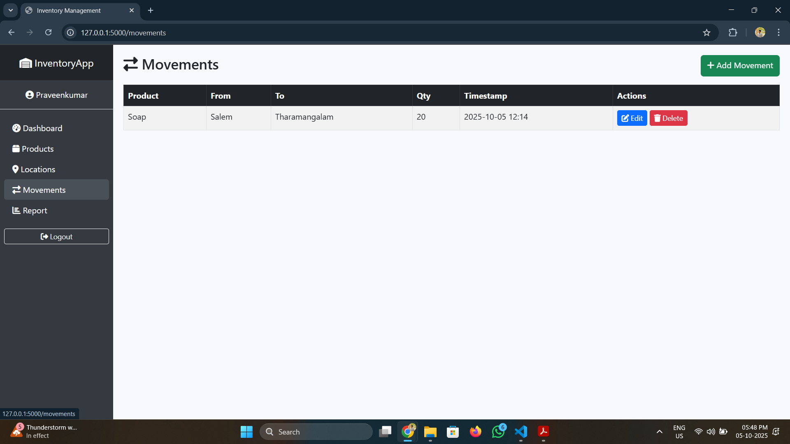

# Inventory Management System


[🔴 Live Site](https://inventory-management-gywp.onrender.com)

A **web-based Inventory Management System** built with **Python Flask**, **SQLAlchemy**, and **Bootstrap**.  
This application allows businesses to efficiently track products across multiple locations, manage stock movements, and maintain a real-time inventory balance.

---


## Table of Contents

- [Features](#features)  
- [Technologies Used](#technologies-used)  
- [Installation](#installation)  
- [Usage](#usage)  
- [Database Structure](#database-structure)  
- [Screenshots](#screenshots)  
- [Project Architecture](#project-architecture)  
- [Contributing](#contributing)  
- [License](#license)

---

## Features

- User authentication: Register, login, and logout securely.  
- Product management: Add, update, and delete products.  
- Location management: Track products in different warehouses or stores.  
- Stock movement tracking: Record movement of products between locations.  
- Dashboard: View current stock balance and movement history.  
- Responsive design: Works well on desktop and mobile devices.

---

## Technologies Used

- **Backend:** Python, Flask, Flask-Login, SQLAlchemy  
- **Frontend:** HTML, CSS, Bootstrap, JavaScript  
- **Database:** SQLite (can be replaced with MySQL/PostgreSQL)  
- **Version Control:** Git & GitHub  

---

## Installation

1. **Clone the repository:**

```
bash
git clone https://github.com/Praveenku-mar/Inventory_Management_System.git
cd Inventory_Management_System
```

2. ## Create a virtual environment and activate it:

```
bash
python -m venv myenv
# Windows
myenv\Scripts\activate
# macOS/Linux
source myenv/bin/activate
```

3. ## Install dependencies:

```
bash
pip install -r requirements.txt
```

4. ## Run the application
```
bash
python app.py
```
5. Open your browser and go to http://127.0.0.1:5000

## Database Structure
- User: Stores user credentials (username, email, password).
- Product: Stores product details (name, SKU, etc.).
- Location: Stores warehouse/store information.
- ProductMovement: Tracks product movements (from_location, to_location, quantity, timestamp).

## Screenshots
## Login Page


## Register 


### Dashboard


### Product


## Product Add


## Location View 


## Location Add


## Movement View


## Movement Add


### Reports


## Contributing 

Contributions are welcome!

- Fork the repository
- Create a new branch (git checkout -b feature-name)
- Commit your changes (git commit -m 'Add feature')
- Push to the branch (git push origin feature-name)
- Create a Pull Request
